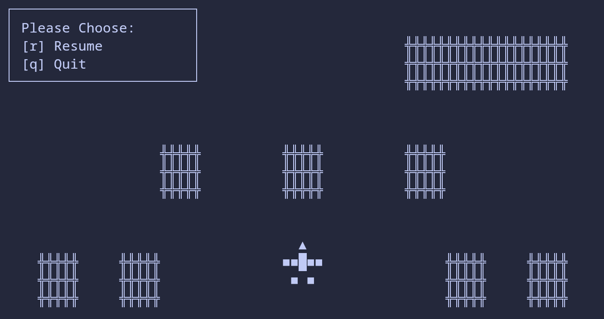
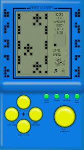

# Terminal Fighter

A nostalgic remake of the classic Brick Game racing experience.



## Installation

> [!NOTE]
> You need to [install Go](https://golang.org/doc/install)

```sh
go install github.com/miladnia/go-terminal-fighter@latest
```

---

## Build and Run

> [!NOTE]
> You need to [install Go](https://golang.org/doc/install)

```sh
git clone https://github.com/miladnia/go-terminal-fighter.git
```

```sh
cd go-terminal-fighter
```

```sh
./build
```

---

## Customization

Maps and levels are formatted in JSON files:

```
- maps/
- levels.json
```

---

## About The Brick Game

The Brick Game, originated in China and Russia in the early 1990s, includes games using a 10 × 20 block grid as a crude, low resolution dot matrix screen. [Wikipedia](https://en.wikipedia.org/wiki/Handheld_electronic_game)


